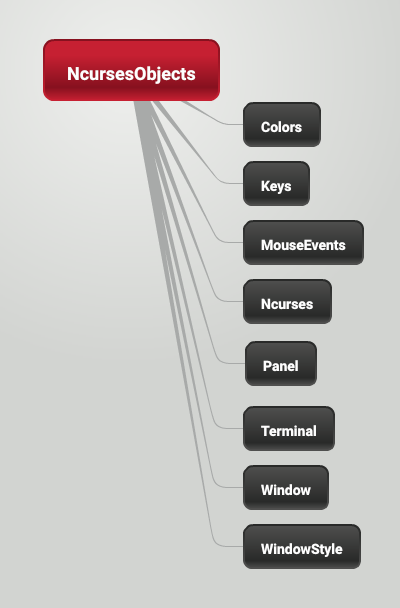

Ncurses Objects
==================
This is a php library that provides ncurses functionality in OOP interface.

[](https://packagist.org/packages/wapmorgan/ncursesobjects)
[](https://packagist.org/packages/wapmorgan/ncursesobjects)
[](https://packagist.org/packages/wapmorgan/ncursesobjects)
[](https://packagist.org/packages/wapmorgan/ncursesobjects)
[](https://packagist.org/packages/wapmorgan/ncursesobjects)

1. Basics
2. Installation
3. Simple application example
4. API
5. Installation of ncurses binding

# Basics



1. There's 4 main classes:
	1. **Ncurses** - main object to act with Ncurses.
	2. **Window** - an object that represents a ncurses windows.
	3. **Panel** - an object that represents a window panels.
	4. **Terminal** - an object to act with Terminal

   And 4 additional classes:

   	1. **Colors** - all colors available in Ncurses
	2. **Keys** - all keys
	3. **MouseEvents** - all events from Mouse
	4. **WindowStyle** - a helper to create style of windows
2. How it works:
   1. ncurses initiation
   2. windows making & filling with text
   3. refresh() calling
   4. go to step **2**
3. Read comments and see examples
4. Ncurses in PHP tutorial: http://devzone.zend.com/173/using-ncurses-in-php/ ([on russian](http://habrahabr.ru/post/186570/)).
5. Ncurses tutorial: http://invisible-island.net/ncurses/ncurses-intro.html, docs: http://pubs.opengroup.org/onlinepubs/007908799/xcurses/curses.h.html

# Installation
Install it via Composer:
```
composer require wapmorgan/ncursesobjects dev-master
```

# Simple application example

1. Create the main object and setup it
    ```php
    $ncurses = new Ncurses;
    $ncurses
    	->setEchoState(false)
    	->setNewLineTranslationState(true)
    	->setCursorState(Ncurses::CURSOR_INVISIBLE)
    	->refresh();
    ```

2. Create the main window
    ```php
    $mainWindow = new Window;
    $mainWindow
    	->border()
    	->title('Hello! Today is '.date('d.m.Y'))
    	->refresh();
    ```

3. Create a small window 10x10 in the center of the main window
    ```php
    $window = Window::createCenteredOf($mainWindow, 10, 10);
    $window
    	->border()
    	->moveCursor(3, 4)
    	->drawStringHere('OK!')
    	->refresh();
    ```

4. Wait for input to see windows
    ```php
    while (true) {
    	$ncurses->inputChar();
	sleep(1);
    }
    ```

5. Close ncurses session and clear the screen (you need do it manually if your script should show any data in normal mode)
    ```php
    unset($ncurses);
    ```

# API
## Main classes
**Ncurses**
- **__construct()** - Initializes Ncurses session
- **getTerminal()** - Returns an instance of Terminal
- **setEchoState(bool $state)** - Sets echo state
- **setNewLineTranslationState($state)** - Sets nl state
- **setCursorState($state)** - Sets cursor state. Applicable values are:
    - Ncurses::CURSOR_INVISIBLE
    - Ncurses::CURSOR_NORMAL
    - Ncurses::CURSOR_VISIBLE
- **moveOutput($y, $x)** - Moves cursor
- **refresh()** - Refreshes main window
- **beep()** - Beep (makes terminal sound)**
- **getCh()** - Reades a char from keyboard
- **unGetCh($ch)** - Reverse function
- **updatePanels()** - Refreshes the virtual screen to reflect the relations between panels in the stack
- **insertChar($char)** - Inserts a char at current position
- **insertDeleteLines($count)** - Inserts a dl-char
- **__destruct()** - Ends Ncurses session

**Terminal**
- **hasKey($keycode)** - Checks for key
- **hasColors()** - Checks for colors support
- **hasIC()** - Check for insert- and delete-capabilities
- **hasIL()** - Check for line insert- and delete-capabilities
- **allAtributes()** - Returns all terminal attributes
- **termName()** - Returns short name of terminal
- **longName()** - Returns full name of terminal

**Window**
- **__construct($columns = 0, $rows = 0, $x = 0, $y = 0)** - Creates a new window
- **static createCenteredOf(Window $parentWindow, $columns, $rows)** - Creates a new window placed in the center of another window
- **getWindow()** - Returns raw ncurses resource
- **getSize(&$columns, &$rows)** - Returns array with size and fill arguments with window size
- **border($left = 0, $right = 0, $top = 0, $bottom = 0, $tl_corner = 0, $tr_corner = 0, $bl_corner = 0, $br_corner = 0)** - Draws a border with different chars
- **borderStyle($style)** - Draws a border with one of styles
- **refresh()** - Refreshes window
- **title($title)** - Draws a window title
- **status($status)** - Draws a window status
- **erase()** - Erases window
- **moveCursor($x, $y)** - Moves cursor
- **drawStringHere($string, $attributes = 0)** - Draws string with attributes
- **makePanel()** - Creates a new panel of this window
- **getPanel()** - Returns panel of this window

**Panel**
- show() - Shows a panel
- hide() - Hides panel
- putOnTop() - Puts panel on top
- putOnBottom() - Puts panel on bottom

## Additional classes
**Colors**
- **Colors::COLOR_BLACK**
- **Colors::COLOR_WHITE**
- **Colors::COLOR_RED**
- **Colors::COLOR_GREEN**
- **Colors::COLOR_YELLOW**
- **Colors::COLOR_BLUE**
- **Colors::COLOR_CYAN**
- **Colors::COLOR_MAGENTA**

**Keys**
- **Keys::KEY_F1**
- **Keys::KEY_F2**
- **Keys::KEY_F3**
- **Keys::KEY_F4**
- **Keys::KEY_F5**
- **Keys::KEY_F6**
- **Keys::KEY_F7**
- **Keys::KEY_F8**
- **Keys::KEY_F9**
- **Keys::KEY_F10**
- **Keys::KEY_F11**
- **Keys::KEY_F12**
- **Keys::KEY_F13**
- **Keys::KEY_F14**
- **Keys::KEY_F15**
- **Keys::KEY_F16**
- **Keys::KEY_F17**
- **Keys::KEY_F18**
- **Keys::KEY_F19**
- **Keys::KEY_F20**
- **Keys::KEY_F21**
- **Keys::KEY_F22**
- **Keys::KEY_F23**
- **Keys::KEY_F24**
- **Keys::KEY_F25**
- **Keys::KEY_F26**
- **Keys::KEY_F27**
- **Keys::KEY_F28**
- **Keys::KEY_F29**
- **Keys::KEY_F30**
- **Keys::KEY_F31**
- **Keys::KEY_F32**
- **Keys::KEY_F33**
- **Keys::KEY_F34**
- **Keys::KEY_F35**
- **Keys::KEY_F36**
- **Keys::KEY_F37**
- **Keys::KEY_F38**
- **Keys::KEY_F39**
- **Keys::KEY_F40**
- **Keys::KEY_F41**
- **Keys::KEY_F42**
- **Keys::KEY_F43**
- **Keys::KEY_F44**
- **Keys::KEY_F45**
- **Keys::KEY_F46**
- **Keys::KEY_F47**
- **Keys::KEY_F48**
- **Keys::KEY_F49**
- **Keys::KEY_F50**
- **Keys::KEY_F51**
- **Keys::KEY_F52**
- **Keys::KEY_F53**
- **Keys::KEY_F54**
- **Keys::KEY_F55**
- **Keys::KEY_F56**
- **Keys::KEY_F57**
- **Keys::KEY_F58**
- **Keys::KEY_F59**
- **Keys::KEY_F60**
- **Keys::KEY_F61**
- **Keys::KEY_F62**
- **Keys::KEY_F63**
- **Keys::KEY_F64**
- **Keys::KEY_LEFT**
- **Keys::KEY_RIGHT**
- **Keys::KEY_HOME**
- **Keys::KEY_BACKSPACE**
- **Keys::KEY_DL**
- **Keys::KEY_IL**
- **Keys::KEY_DC**
- **Keys::KEY_IC**
- **Keys::KEY_EIC**
- **Keys::KEY_CLEAR**
- **Keys::KEY_EOS**
- **Keys::KEY_EOL**
- **Keys::KEY_SF**
- **Keys::KEY_SR**
- **Keys::KEY_NPAGE**
- **Keys::KEY_PPAGE**
- **Keys::KEY_STAB**
- **Keys::KEY_CTAB**
- **Keys::KEY_CATAB**
- **Keys::KEY_SRESET**
- **Keys::KEY_RESET**
- **Keys::KEY_PRINT**
- **Keys::KEY_LL**
- **Keys::KEY_A1**
- **Keys::KEY_A3**
- **Keys::KEY_B2**
- **Keys::KEY_C1**
- **Keys::KEY_C3**
- **Keys::KEY_BTAB**
- **Keys::KEY_BEG**
- **Keys::KEY_CANCEL**
- **Keys::KEY_CLOSE**
- **Keys::KEY_COMMAND**
- **Keys::KEY_COPY**
- **Keys::KEY_CREATE**
- **Keys::KEY_END**
- **Keys::KEY_EXIT**
- **Keys::KEY_FIND**
- **Keys::KEY_HELP**
- **Keys::KEY_MARK**
- **Keys::KEY_MESSAGE**
- **Keys::KEY_MOVE**
- **Keys::KEY_NEXT**
- **Keys::KEY_OPEN**
- **Keys::KEY_OPTIONS**
- **Keys::KEY_PREVIOUS**
- **Keys::KEY_REDO**
- **Keys::KEY_REFERENCE**
- **Keys::KEY_REFRESH**
- **Keys::KEY_REPLACE**
- **Keys::KEY_RESTART**
- **Keys::KEY_RESUME**
- **Keys::KEY_SAVE**
- **Keys::KEY_SBEG**
- **Keys::KEY_SCANCEL**
- **Keys::KEY_SCOMMAND**
- **Keys::KEY_SCOPY**
- **Keys::KEY_SCREATE**
- **Keys::KEY_SDC**
- **Keys::KEY_SDL**
- **Keys::KEY_SELECT**
- **Keys::KEY_SEND**
- **Keys::KEY_SEOL**
- **Keys::KEY_SEXIT**
- **Keys::KEY_SFIND**
- **Keys::KEY_SHELP**
- **Keys::KEY_SHOME**
- **Keys::KEY_SIC**
- **Keys::KEY_SLEFT**
- **Keys::KEY_SMESSAGE**
- **Keys::KEY_SMOVE**
- **Keys::KEY_SNEXT**
- **Keys::KEY_SOPTIONS**
- **Keys::KEY_SPREVIOUS**
- **Keys::KEY_SPRINT**
- **Keys::KEY_SREDO**
- **Keys::KEY_SREPLACE**
- **Keys::KEY_SRIGHT**
- **Keys::KEY_SRSUME**
- **Keys::KEY_SSAVE**
- **Keys::KEY_SSUSPEND**
- **Keys::KEY_UNDO**
- **Keys::KEY_MOUSE**
- **Keys::KEY_MAX**
- **Keys::KEY_LF**
- **Keys::KEY_CR**
- **Keys::KEY_ESC**
- **Keys::KEY_TAB**

**MouseEvents**
- **MouseEvents::BUTTON1_RELEASED**
- **MouseEvents::BUTTON2_RELEASED**
- **MouseEvents::BUTTON3_RELEASED**
- **MouseEvents::BUTTON4_RELEASED**
- **MouseEvents::BUTTON1_PRESSED**
- **MouseEvents::BUTTON2_PRESSED**
- **MouseEvents::BUTTON3_PRESSED**
- **MouseEvents::BUTTON4_PRESSED**
- **MouseEvents::BUTTON1_CLICKED**
- **MouseEvents::BUTTON2_CLICKED**
- **MouseEvents::BUTTON3_CLICKED**
- **MouseEvents::BUTTON4_CLICKED**
- **MouseEvents::BUTTON1_DOUBLE_CLICKED**
- **MouseEvents::BUTTON2_DOUBLE_CLICKED**
- **MouseEvents::BUTTON3_DOUBLE_CLICKED**
- **MouseEvents::BUTTON4_DOUBLE_CLICKED**
- **MouseEvents::BUTTON1_TRIPLE_CLICKED**
- **MouseEvents::BUTTON2_TRIPLE_CLICKED**
- **MouseEvents::BUTTON3_TRIPLE_CLICKED**
- **MouseEvents::BUTTON4_TRIPLE_CLICKED**
- **MouseEvents::BUTTON_CTRL**
- **MouseEvents::BUTTON_SHIFT**
- **MouseEvents::BUTTON_ALT**
- **MouseEvents::ALL_MOUSE_EVENTS**
- **MouseEvents::REPORT_MOUSE_POSITION**

# Installation of ncurses binding

1. Install pecl. It is in a package named `php5-dev` in Ubuntu (`php-pear` in ArchLinux)
2. Install the ncurses binding.
    ```
    sudo pecl install ncurses
    ```

3. Include the php extension. Add follows in your php.ini:
    ```
    extension=ncurses.so
    ```
